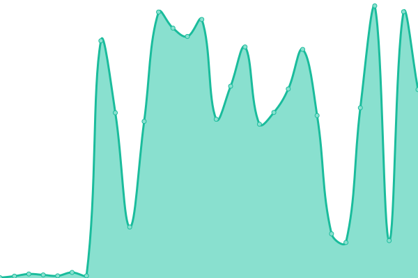
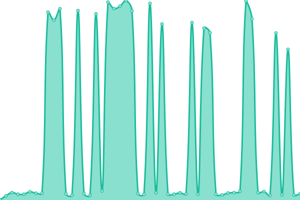
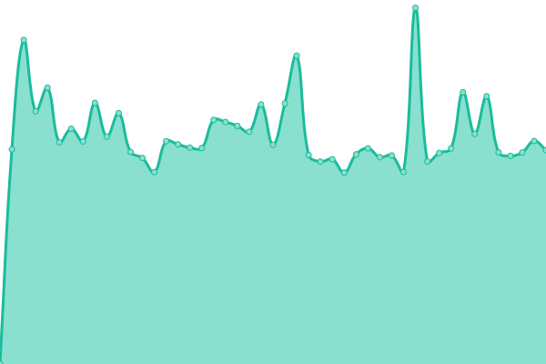
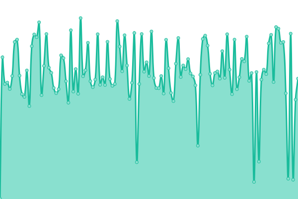
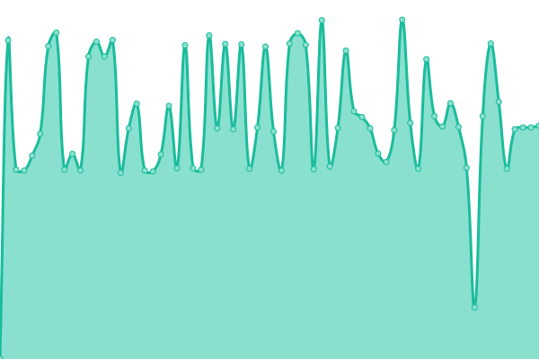

# [📈 Live Status](https://status.vpmm.dev): <!--live status--> **🟧 Partial outage**

<!--start: status pages-->
<!-- This summary is generated by Upptime (https://github.com/upptime/upptime) -->
<!-- Do not edit this manually, your changes will be overwritten -->
<!-- prettier-ignore -->
| URL | Status | History | Response Time | Uptime |
| --- | ------ | ------- | ------------- | ------ |
|  [[LIVE] VPMM Frontend](https://vpmm.dev) | 🟩 Up | [live-vpmm-frontend.yml](https://github.com/Hackebein/vpmm-upptime/commits/HEAD/history/live-vpmm-frontend.yml) | 

 509ms
     
 | 

<a href="https://status.vpmm.dev/history/live-vpmm-frontend">100.00%</a>
    

|  [[LIVE] VPM Index](https://vpmm.dev/index.json) | 🟩 Up | [live-vpm-index.yml](https://github.com/Hackebein/vpmm-upptime/commits/HEAD/history/live-vpm-index.yml) | 

 376ms
     
 | 

<a href="https://status.vpmm.dev/history/live-vpm-index">100.00%</a>
    

|  [[LIVE] VPMM Index](https://vpmm.dev/vpmm.json) | 🟩 Up | [live-vpmm-index.yml](https://github.com/Hackebein/vpmm-upptime/commits/HEAD/history/live-vpmm-index.yml) | 

 6415ms
     
 | 

<a href="https://status.vpmm.dev/history/live-vpmm-index">100.00%</a>
    

|  [[STAGING] VPMM Frontend](https://staging.vpmm.dev) | 🟩 Up | [staging-vpmm-frontend.yml](https://github.com/Hackebein/vpmm-upptime/commits/HEAD/history/staging-vpmm-frontend.yml) | 

 652ms
     
 | 

<a href="https://status.vpmm.dev/history/staging-vpmm-frontend">66.28%</a>
    

|  [[STAGING] VPM Index](https://staging.vpmm.dev/index.json) | 🟥 Down | [staging-vpm-index.yml](https://github.com/Hackebein/vpmm-upptime/commits/HEAD/history/staging-vpm-index.yml) | 

 534ms
     
 | 

<a href="https://status.vpmm.dev/history/staging-vpm-index">100.00%</a>
    

|  [[STAGING] VPMM Index](https://staging.vpmm.dev/vpmm.json) | 🟥 Down | [staging-vpmm-index.yml](https://github.com/Hackebein/vpmm-upptime/commits/HEAD/history/staging-vpmm-index.yml) | 

 551ms
     
 | 

<a href="https://status.vpmm.dev/history/staging-vpmm-index">100.00%</a>
    

<!--end: status pages-->

[**Visit our status website →**](https://status.vpmm.dev)

Powered by: [Upptime](https://github.com/upptime/upptime)
